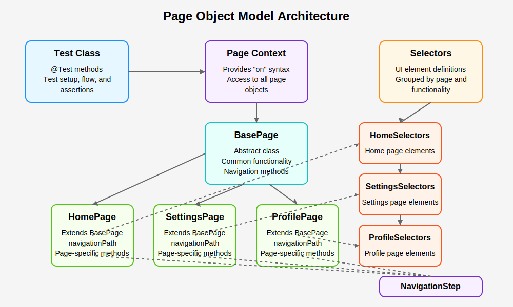
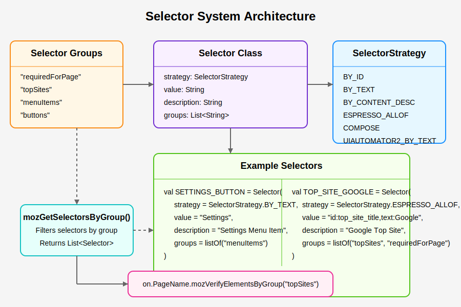
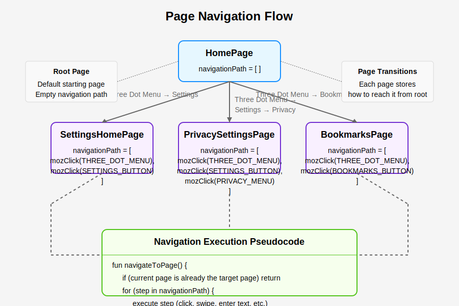
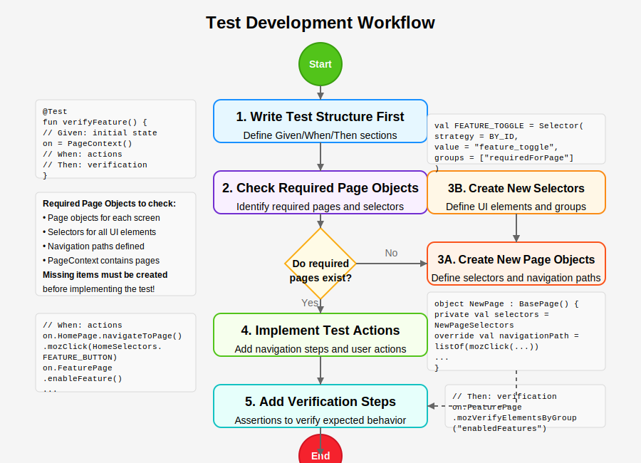

# Page Object Model for Android Test Automation

## Overview

This testing framework implements the Page Object Model (POM) pattern for Android UI testing, providing a structured, maintainable approach to writing automated tests. Rather than embedding UI element interactions directly in test scripts, we abstract these details into "page objects" that represent the screens of the application.

The framework leverages a hybrid approach that supports Espresso, UIAutomator, and Jetpack Compose testing in a unified way, with a focus on readability, maintainability, and reduced test flakiness.

```kotlin
// Example test using our POM framework
@Test
fun verifyHomepageSettingsTest() {
    // Given: The application starts with default settings
    on = PageContext()
    
    // When: We navigate to the Settings Homepage
    on.SettingsHomePage.navigateToPage()
    
    // Then: All required elements and top site elements are visible
    on.SettingsHomePage
        .mozVerifyElementsByGroup("requiredForPage")
        .mozVerifyElementsByGroup("topSites")
}
```

## Architecture

Our implementation of the Page Object Model uses the following key components:



### Core Components

1. **BasePage**: Abstract class that all page objects inherit from, providing common functionality
2. **Selector**: Data class for defining UI elements with metadata
3. **NavigationStep**: Class hierarchy for defining navigation actions
4. **PageContext**: Handles access to page objects via the fluent `on` syntax

### Key Benefits vs. Traditional Approaches

| Feature | Our POM Approach | Traditional Approach |
|---------|------------------|---------------------|
| Test readability | High - tests read like user stories | Low - tests contain implementation details |
| Maintainability | High - UI changes only affect page objects | Low - UI changes require updating many tests |
| Reusability | High - navigation paths and assertions are reusable | Low - often contains duplicated code |
| Learning curve | Medium - requires understanding the pattern | Low - simpler to start but harder to maintain |
| Test stability | High - built-in waiting mechanisms | Variable - often relies on sleep statements |

## Detailed Component Breakdown

### BasePage

The `BasePage` abstract class is the foundation of all page objects:

```kotlin
abstract class BasePage {
    // Navigation path from root page (HomePage)
    abstract val navigationPath: List<NavigationStep>
    
    // Methods for page navigation, element verification, and interactions
    fun navigateToPage(): BasePage { /* ... */ }
    fun mozWaitForPageToLoad(timeout: Long = 10000): Boolean { /* ... */ }
    abstract fun mozGetSelectorsByGroup(group: String): List<Selector>
    fun mozVerifyElementsByGroup(group: String): BasePage { /* ... */ }
    // Element interaction methods
    fun mozClick(selector: Selector): BasePage { /* ... */ }
    fun mozGetElement(selector: Selector): Any? { /* ... */ }
    fun mozVerifyElement(selector: Selector): Boolean { /* ... */ }
}
```

### Selector System

The Selector system provides a flexible way to define UI elements with metadata:



```kotlin
data class Selector(
    val strategy: SelectorStrategy,  // How to find the element
    val value: String,               // What to look for
    val description: String,         // Human-readable description
    val groups: List<String> = listOf() // Categorization (e.g., "requiredForPage")
)

enum class SelectorStrategy {
    BY_ID, BY_TEXT, BY_CONTENT_DESC, BY_RES, BY_CLASS,
    ESPRESSO_ALLOF, COMPOSE, UIAUTOMATOR2_BY_TEXT, UIAUTOMATOR2_BY_RES_ID
}
```

### Navigation System

The Navigation system handles moving between pages:

```kotlin
sealed class NavigationStep {
    data class Click(val selector: Selector) : NavigationStep()
    data class Swipe(val swipeAction: () -> Unit) : NavigationStep()
    // Other step types...
}

// Helper functions
fun mozClick(selector: Selector): NavigationStep = NavigationStep.Click(selector)
fun perform(action: () -> Unit): NavigationStep = NavigationStep.Swipe(action)
```



### Page Context

The PageContext provides the "on" syntax sugar:

```kotlin
class PageContext {
    val HomePage = HomePage
    val SettingsHomePage = SettingsHomePage
    // Other page objects...
}
```

## Implementation Guide

### Creating a New Page Object

1. Create a selector file for the page:

```kotlin
// ProfileSelectors.kt
object ProfileSelectors {
    val PROFILE_TITLE = Selector(
        strategy = SelectorStrategy.BY_TEXT,
        value = "Profile",
        description = "Profile Page Title",
        groups = listOf("requiredForPage")
    )
    
    // Other selectors...
    
    val all = listOf(PROFILE_TITLE, /* other selectors */)
}
```

2. Create the page object:

```kotlin
// ProfilePage.kt
object ProfilePage : BasePage() {
    private val selectors = ProfileSelectors
    
    override val navigationPath: List<NavigationStep> = listOf(
        mozClick(HomeSelectors.THREE_DOT_MENU),
        mozClick(HomeSelectors.PROFILE_BUTTON)
    )
    
    override fun mozGetSelectorsByGroup(group: String): List<Selector> {
        return selectors.all.filter { it.groups.contains(group) }
    }
    
    // Page-specific methods...
}
```

3. Add the page to PageContext:

```kotlin
class PageContext {
    // Existing pages...
    val ProfilePage = ProfilePage
}
```

### Updating Selectors

When UI elements change, you only need to update the selector definitions:

```kotlin
// Before update
val SETTINGS_BUTTON = Selector(
    strategy = SelectorStrategy.BY_TEXT,
    value = "Settings",
    description = "Settings Menu Item",
    groups = listOf("menuItems")
)

// After update (e.g., if the UI changed to use an icon)
val SETTINGS_BUTTON = Selector(
    strategy = SelectorStrategy.BY_CONTENT_DESC,
    value = "Settings",
    description = "Settings Menu Item",
    groups = listOf("menuItems")
)
```

## Workflow: Writing a New Test



### Step 1: Write the Test Structure First

Start by outlining your test with clear Given/When/Then sections:

```kotlin
@Test
fun verifyPrivateBrowsingShortcut() {
    // Given: The application starts with default settings
    on = PageContext()

    // When: We navigate to Settings and enable private browsing shortcut
    // PLACEHOLDER: Steps to navigate to settings and enable shortcut
    
    // Then: Private browsing shortcut should appear on home screen
    // PLACEHOLDER: Verification steps
}
```

### Step 2: Implement the Test Logic

Fill in the placeholders with page object calls:

```kotlin
@Test
fun verifyPrivateBrowsingShortcut() {
    // Given: The application starts with default settings
    on = PageContext()

    // When: We navigate to Settings and enable private browsing shortcut
    on.SettingsHomePage.navigateToPage()
        .mozClick(SettingsHomeSelectors.PRIVACY_MENU)
    
    on.PrivacySettingsPage
        .mozClick(PrivacySettingsSelectors.PRIVATE_SHORTCUT_TOGGLE)
    
    // Navigate back to home
    on.HomePage.navigateToPage()
    
    // Then: Private browsing shortcut should appear on home screen
    on.HomePage.mozVerifyElement(HomeSelectors.PRIVATE_BROWSING_SHORTCUT)
}
```

### Step 3: Create Missing Page Objects and Selectors

If the test requires pages or selectors that don't exist yet:

1. Create the necessary selector files (e.g., `PrivacySettingsSelectors.kt`)
2. Create the page objects (e.g., `PrivacySettingsPage.kt`) 
3. Add any new selectors to existing pages if needed
4. Update the `PageContext` to include new pages

### Step 4: Run and Refine

Run the test, debug any issues, and refine as needed.

## Best Practices

### Structuring Tests in Three Phases

Always structure tests in three clear phases:

```kotlin
@Test
fun exampleTest() {
    // Given: Initial state or preconditions
    // Set up the test environment, use default app settings
    on = PageContext()
    
    // When: Actions performed by the user
    // Navigate, interact, trigger the behavior being tested
    on.SettingsPage.navigateToPage()
        .mozClick(SettingsSelectors.FEATURE_TOGGLE)
    
    // Then: Expected outcomes
    // Verify the application behaves as expected
    on.SettingsPage.mozVerifyElementState(SettingsSelectors.FEATURE_TOGGLE, isEnabled = true)
    on.HomePage.navigateToPage()
        .mozVerifyElement(HomeSelectors.FEATURE_INDICATOR)
}
```

### Selector Grouping

Use meaningful groups for your selectors:

- `requiredForPage`: Elements that must be present for the page to be considered loaded
- `topSites`, `menuItems`, etc.: Functional groups for related UI elements
- `inputs`, `buttons`, etc.: Element type groupings

### Navigation Paths

Keep navigation paths in the page objects, not in the tests:

```kotlin
// Good: Navigation details encapsulated in the page object
on.SettingsPage.navigateToPage()

// Avoid: Navigation details in the test
on.HomePage
    .mozClick(HomeSelectors.MENU)
    .mozClick(HomeSelectors.SETTINGS)
```

## Extending the Framework

### Adding Custom Navigation Steps

To add new types of navigation steps:

1. Extend the `NavigationStep` sealed class:

```kotlin
sealed class NavigationStep {
    // Existing steps...
    data class LongPress(val selector: Selector) : NavigationStep()
    data class Wait(val milliseconds: Long) : NavigationStep()
}
```

2. Update the `executeNavigationPath` method in `BasePage`:

```kotlin
private fun executeNavigationPath() {
    navigationPath.forEach { step ->
        when (step) {
            // Existing cases...
            is NavigationStep.LongPress -> mozLongPress(step.selector)
            is NavigationStep.Wait -> Thread.sleep(step.milliseconds)
        }
    }
}
```

3. Add helper functions:

```kotlin
fun mozLongPress(selector: Selector): NavigationStep = NavigationStep.LongPress(selector)
fun wait(milliseconds: Long): NavigationStep = NavigationStep.Wait(milliseconds)
```

### Adding Support for New UI Technologies

To add support for a new UI technology:

1. Add new strategy types to `SelectorStrategy`
2. Update the `mozGetElement` and `mozVerifyElement` methods in `BasePage`
3. Create helper functions for new interaction types

## Common Issues and Solutions

### Test Flakiness

If tests are flaky due to timing issues:

1. Adjust the default timeout in `mozWaitForPageToLoad`
2. Add more robust waiting mechanisms
3. Ensure all "required" elements are properly defined

### Element Not Found Errors

If elements aren't being found:

1. Check that selectors are defined correctly
2. Verify the element is visible in the UI
3. Try a different selector strategy
4. Add logging to debug element search

## Conclusion

The Page Object Model approach provides a structured way to create maintainable, readable automated tests. By abstracting UI details into page objects, we create a testing framework that is resilient to UI changes, promotes code reuse, and enables clear, expressive tests.

This README provides the foundation for understanding and extending our implementation. As the application evolves, the page objects and selectors can be updated with minimal impact on existing tests, ensuring a stable and reliable test suite.
