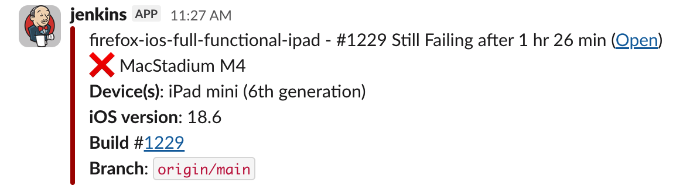
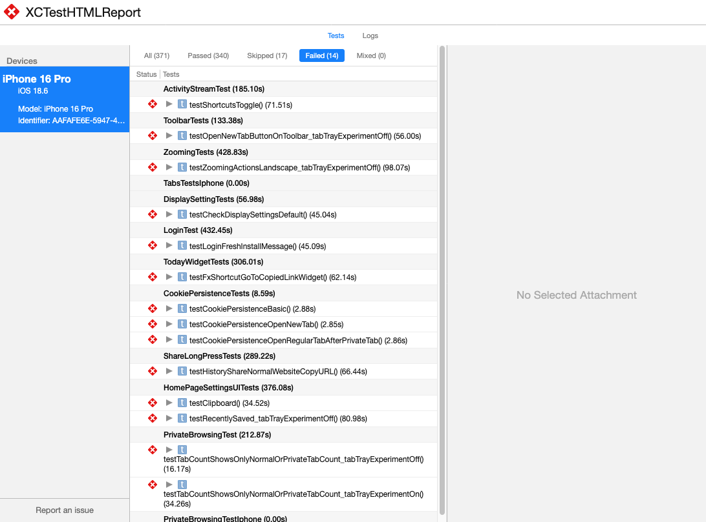

# xchtmlreport-extract

After the Firefox/Focus iOS tests are run on our CI/CD, a notification
sends out to #mobile-alerts-ios channel to report the test results



The public URL brings up a test report that looks like the following:



This format, which is generated by `xchtmlreport`, is not ideal to
extract just the test names of the failed tests and re-run the failed
tests locally.

This tool extracts the test names of failed tests and output the
`xcodebuild` command to re-run them using the same type of the iOS
simulator locally.

## Usage
```
python retry-flaky-tests.py --url <URL> [--testPlan <TestPlan>] [--parallel <NumParallel>]
```
* `--url` (mandatory): Public URL of the test report
* `--testPlan`: Test plan where the tests are located (default: `FullFunctionalTestPlan`)
* `--parallel`: Number of parallel simulators (default: `2`)
* `--iterations`: Number of repetitions (default: `2`)

## Example
```
$ python retry-flaky-tests.py --url https://storage.googleapis.com/report.html
# Failed Tests
ActivityStreamTest/testShortcutsToggle
ToolbarTests/testOpenNewTabButtonOnToolbar_tabTrayExperimentOff
ZoomingTests/testZoomingActionsLandscape_tabTrayExperimentOff
DisplaySettingTests/testCheckDisplaySettingsDefault
LoginTest/testLoginFreshInstallMessage
TodayWidgetTests/testFxShortcutGoToCopiedLinkWidget
CookiePersistenceTests/testCookiePersistenceBasic
CookiePersistenceTests/testCookiePersistenceOpenNewTab
CookiePersistenceTests/testCookiePersistenceOpenRegularTabAfterPrivateTab
ShareLongPressTests/testHistoryShareNormalWebsiteCopyURL
HomePageSettingsUITests/testClipboard
HomePageSettingsUITests/testRecentlySaved_tabTrayExperimentOff
PrivateBrowsingTest/testTabCountShowsOnlyNormalOrPrivateTabCount_tabTrayExperimentOff
PrivateBrowsingTest/testTabCountShowsOnlyNormalOrPrivateTabCount_tabTrayExperimentOn

# xcodebuild command for re-run
xcodebuild test-without-building -target Client -scheme Fennec \
 -destination 'platform=iOS Simulator,name=iPhone 16 Pro,OS=18.6' \
 -testPlan FullFunctionalTestPlan -parallel-testing-enabled YES \
 -parallel-testing-worker-count 2 -test-iterations 2 \
 -only-testing:XCUITests/ActivityStreamTest/testShortcutsToggle \
 -only-testing:XCUITests/ToolbarTests/testOpenNewTabButtonOnToolbar_tabTrayExperimentOff \
 -only-testing:XCUITests/NavigationTest/testCopyLinkPrivateMode_tabTrayExperimentOff \
 -only-testing:XCUITests/SwipingTabsTests/testSwipeToSwitchTabs_swipingTabsExperimentOn \
 -only-testing:XCUITests/TodayWidgetTests/testFxShortcutGoToCopiedLinkWidget \
 -only-testing:XCUITests/CookiePersistenceTests/testCookiePersistenceBasic \
 -only-testing:XCUITests/CookiePersistenceTests/testCookiePersistenceOpenNewTab \
 -only-testing:XCUITests/CookiePersistenceTests/testCookiePersistenceOpenRegularTabAfterPrivateTab \
 -only-testing:XCUITests/HomePageSettingsUITests/testRecentlySaved_tabTrayExperimentOff \
 -only-testing:XCUITests/DisplaySettingTests/testCheckDisplaySettingsDefault \
 -only-testing:XCUITests/ZoomingTests/testZoomingActionsLandscape_tabTrayExperimentOff \
 -only-testing:XCUITests/PrivateBrowsingTest/testTabCountShowsOnlyNormalOrPrivateTabCount_tabTrayExperimentOff \
 -only-testing:XCUITests/PrivateBrowsingTest/testTabCountShowsOnlyNormalOrPrivateTabCount_tabTrayExperimentOn
````